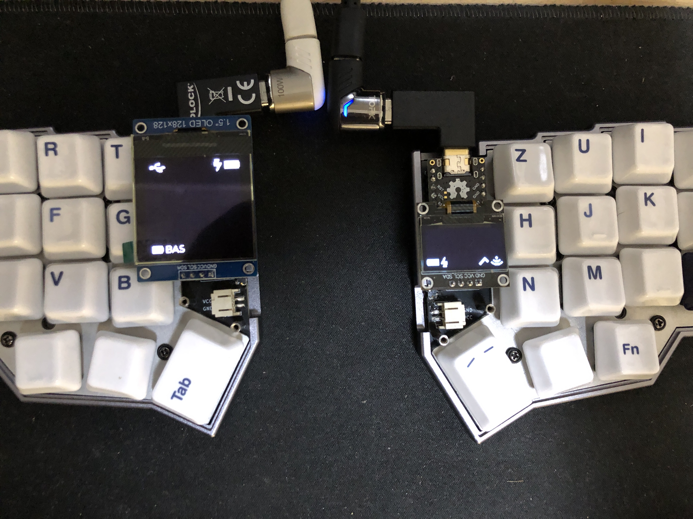
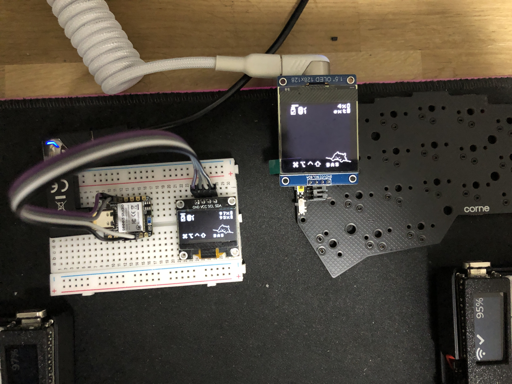

# Oled Adapter
This module is an adapter for 128x32, 128x64 and 128x128 OLED screens, to be
used on keyboards with ZMK without having to modify the shields of the
keyboards.

Compatible with all boards with pro micro and seeeduino xiao BLE pinout, like
the Nice!Nano, Puchi, clones and others.

Shields supported:
- oled_adapter_pro_micro_128x32
- oled_adapter_pro_micro_128x64
- oled_adapter_pro_micro_128x128
- oled_adapter_seeeduino_xiao_ble_128x32
- oled_adapter_seeeduino_xiao_ble_128x64
- oled_adapter_seeeduino_xiao_ble_128x128

[](https://github.com/mctechnology17/zmk-config)
[](https://github.com/mctechnology17/zmk-config)

# Usage
The following commands demonstrate how to overwrite the default 128x32 screen
with different screen sizes for various setups as an example:

- **Overwrite the left screen from 128x32 to 128x128:**
  ```bash
  west build -b nice_nano_v2 -- -DSHIELD="corne_left oled_adapter_pro_micro_128x128"
  ```

- **Overwrite the right screen from 128x32 to 128x64:**
  ```bash
  west build -b puchi_ble_v1 -- -DSHIELD="corne_right oled_adapter_pro_micro_128x64"
  ```

- **Using the Xiao as a dongle with the Corne, replacing the screen with 128x128:**
  ```bash
  # This example is from a dongle previously configured using a corne
  west build -b seeeduino_xiao_ble -- -DSHIELD="corne_dongle_xiao dongle_display oled_adapter_seeeduino_xiao_ble_128x128"
  ```

# Configuration
To use this module, first add it to your `config/west.yml` by adding a new
entry to `remotes` and `projects`:

```yaml
manifest:
  remotes:
    - name: zmkfirmware
      url-base: https://github.com/zmkfirmware
    - name: mctechnology17
      url-base: https://github.com/mctechnology17
  projects:
    - name: zmk
      remote: zmkfirmware
      revision: main
      import: app/west.yml
    - name: zmk-config
      remote: mctechnology17
      revision: main
  self:
    path: config
```

Now simply indicate in the board and the shield in the `build.yaml` file:

```yaml
---
include:
  - board: nice_nano_v2
    shield: corne_left oled_adapter_pro_micro_128x128
  - board: puchi_ble_v1
    shield: corne_right oled_adapter_pro_micro_128x64
```
